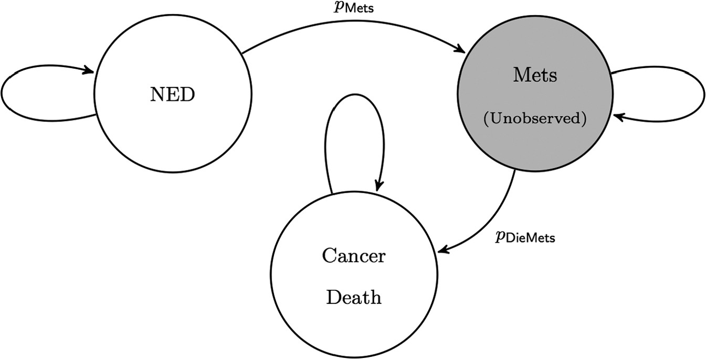

The "Cancer Relative Survival Model" represents transitions between three states: no evidence of disease (NED), cancer metastasis (Mets), and cancer death.

<br>
<br>

<figure>
  
  <figcaption>CRS State Diagram [@Alarid-Escudero2018a] </figcaption>
</figure>

<br>
<br>
We need to calibrate the two transition probabilities in the figure above - `p.Mets`, `p.DieMets` - because these transition probabilities are unobservable (at least in this example).

To calibrate `p.Mets` and `p.DieMets`, we will fit the model to observed survival data. To do this, we'll sample the two parameters randomly, and then measure how well the model-predicted survival matches the observed survival.

We'll use the following packages:

```{r message=FALSE}
# calibration functionality
library(lhs)

# visualization
library(plotrix)
library(psych)
```


# Targets

The hypothetical calibration target is the proportion of people that survive over time. 

```{r}
load("CRSTargets.RData")
```


Let's see what the survival looks like.

```{r}
plotrix::plotCI(x = CRS.targets$Surv$Time, y = CRS.targets$Surv$value, 
                ui = CRS.targets$Surv$ub,
                li = CRS.targets$Surv$lb,
                ylim = c(0, 1), 
                xlab = "Time", ylab = "Pr Survive")
```

Note that the estimate of survival has some uncertainty around it, indicated by the error bounds.

If you had another target (stored in `CRS.targets$Target2`), you could plot it like this:

```
plotrix::plotCI(x = CRS.targets$Target2$Time, y = CRS.targets$Target2$value,
                ui = CRS.targets$Target2$ub,
                li = CRS.targets$Target2$lb,
                ylim = c(0, 1),
                xlab = "Time", ylab = "Target 2")
```


# Model

The inputs to the function are parameters to be estimated through calibration. The model outputs correspond to the target data.

This creates the function `markov_crs()`. The function has one argument, `v.params`, which is a vector of parameters. In this case, `v.params` is a named vector with elements `p.Mets` and `p.DieMets`.


```{r}
source("markov_crs.R")
```


Let's check that the model runs. We arbitrarily set some parameter values in `v.parms.test`, then run the model. 

```{r}
v.params.test <- c(p.Mets = 0.1, p.DieMets = 0.2)
test_results <- markov_crs(v.params.test)
```

Within the returned model object (a list), the predicted survival is in a vector called `Surv`:
```{r}
str(test_results)
head(test_results$Surv)
plot(test_results$Surv)
```

It works!

But let's compare the outputs to the targets.

```{r}
plotrix::plotCI(x = CRS.targets$Surv$Time, y = CRS.targets$Surv$value, 
                ui = CRS.targets$Surv$ub,
                li = CRS.targets$Surv$lb,
                ylim = c(0, 1), 
                xlab = "Time", ylab = "Pr Survive")
points(test_results$Surv,
       col = "green", pch = 20)
legend("topright", legend = c("Targets", "Outputs"),
       col = c("black", "green"),
       pch = c(1, 20))
```

That doesn't look right! We need to *calibrate* the unobservable parameters so that the results match the observed data.

# Random Search Calibration

For random search with latin hypercube sampling, we need to specify:

1. The number of samples
2. The range of each parameter


First, when sampling random numbers in `R`, setting a seed allows you to obtain the same sample each time.

```{r}
set.seed(1010)
```

Let's start with 1000 samples. We're calibrating 2 parameters, `p.Mets` and `p.DieMets`.

```{r}
param.names <- c("p.Mets","p.DieMets")
n.param <- length(param.names)
rs.n.samp <- 1000
```

The boundaries on the search space are as follows:
```{r}
# lower bound
lb <- c(p.Mets = 0.04, p.DieMets = 0.04) 

# upper bound
ub <- c(p.Mets = 0.16, p.DieMets = 0.16)
```

Now, we sample. Right away, we rename the columns of `m.lhs.unit` so we can keep track of which column is which.

```{r}
# Sample unit Latin Hypercube
m.lhs.unit <- lhs::randomLHS(rs.n.samp, n.param)
colnames(m.lhs.unit) <- param.names
head(m.lhs.unit)
```

Note that this does not yet incorporate the ranges we specified. 

```{r fig.width = 6}
plot(x = m.lhs.unit[, param.names[1]],
     y = m.lhs.unit[, param.names[2]],
     xlab = param.names[1],
     ylab = param.names[2])
```

We have to rescale to the ranges we specified. (Note: we can start with a LHS sample and then transform it to *any* distribution - in this case, we're rescaling it to a uniform distribution)

```{r}
# Rescale to min/max of each parameter
rs.param.samp <- matrix(nrow=rs.n.samp,ncol=n.param)
colnames(rs.param.samp) <- param.names
for (i in 1:n.param){
  rs.param.samp[,i] <- qunif(m.lhs.unit[,i],
                           min = lb[i],
                           max = ub[i])
}
```

Now, the parameters are within the range we specified.

```{r}
# view resulting parameter set samples
psych::pairs.panels(rs.param.samp)
```


## Run the Calibration

We have `r rs.n.samp` parameter sets, so we'll have `r rs.n.samp` entries in the goodness-of-fit vector. We're currently using a single target, so we'll have one column (i.e., a vector).

```{r}
# initialize goodness-of-fit vector
rs.GOF <- rep(0, rs.n.samp)
```

Now, we run the model for each set of input values, and determine how well the model results fit the target data.

In this case, the goodness of fit function is the likelihood of observing the target data, given the model results. We assume a normal likelihood for this example. In many cases, it's more numerically stable to use the log-likelihood `log = TRUE` and sum the individual likelihoods together.

```{r}
gof_norm_loglike <- function(target_mean, target_sd, model_output){
  sum(dnorm(x = target_mean,
            mean = model_output,
            sd = target_sd,
            log = TRUE))
}
```

Loop through sampled sets of input values

```{r}
for (j in 1:rs.n.samp){
  
  ###  Run model for a given parameter set  ###
  model.res = markov_crs(v.params = rs.param.samp[j, ])
  
  ###  Calculate goodness-of-fit of model outputs to targets  ###
  # log likelihood of the model output given the targets
  rs.GOF[j] = gof_norm_loglike(model_output = model.res$Surv,
                               target_mean = CRS.targets$Surv$value,
                               target_sd = CRS.targets$Surv$se)
}
```

## Best-fitting parameters

```{r}
# Arrange parameter sets in order of fit
rs.calib.res <- cbind(rs.param.samp, rs.GOF)
rs.calib.res <- rs.calib.res[order(-rs.calib.res[,"rs.GOF"]),]

# Examine the top 10 best-fitting sets
rs.calib.res[1:10,]

# Plot the top 100 (top 10%)
plot(x = rs.calib.res[1:100,1], y = rs.calib.res[1:100,2],
     xlim=c(lb[1],ub[1]),ylim=c(lb[2],ub[2]),
     xlab = colnames(rs.calib.res)[1],ylab = colnames(rs.calib.res)[2])
```

How does the model look with the best-fitting set?

```{r}
rs_best_fit_params <- c(rs.calib.res[1, c("p.Mets",  "p.DieMets")])
rs_best_fit_model <- markov_crs(rs_best_fit_params)

plotrix::plotCI(x = CRS.targets$Surv$Time, y = CRS.targets$Surv$value, 
                ui = CRS.targets$Surv$ub,
                li = CRS.targets$Surv$lb,
                ylim = c(0, 1), 
                xlab = "Time", ylab = "Pr Survive")
points(x = names(rs_best_fit_model$Surv), y = rs_best_fit_model$Surv,
       col = "green",
       pch = 20)
legend("topright", legend = c("Targets", "Random Search"),
       col = c("black", "green"),
       pch = c(1, 20))
```

## Other likelihoods

We used a normal likelihood as a goodness-of-fit measure above, but there are many other options. For example, we could use a weighted sum of squared errors.

```
gof_wsse <- function(model_output, target_mean, target_se){
    w = 1/(target_se^2)
    gof <-  (-1) * sum(w*(model_output - target_mean)^2) 
    return(gof)
}
```


## Multiple Targets

There is nothing restricting us to a single target, either. If we do use multiple targets, we can combine the multiple goodness-of-fit measures into a single GOF, possibly using weights to indicate the importance of each target.

If we had 2 targets, we would define a GOF *matrix* with two columns:

```
# initialize goodness-of-fit matrix
rs.GOF <- matrix(0, nrow = n.samp, ncol = 2)

for (j in 1:n.samp){
  
  ###  Run model for a given parameter set  ###
  model.res = markov_crs(v.params = rs.params.samp[j, ])
  
  ###  Target 1  ###
  rs.GOF[j, 1] = gof_norm_loglike(model_output = model.res$Output1,
                              target_mean = CRS.targets$Target1$value,
                              target_sd = CRS.targets$Target1$se)
  
  ### Target 2 ###
  rs.GOF[j, 2] = gof_norm_loglike(model_output = model.res$Output2,
                              target_mean = CRS.targets$Target2$value,
                              target_sd = CRS.targets$Target2$se)
}
```

Then, we would combine the GoFs into a single, multiplying by a `v.weights`, a vector of weights (here, equal weights).

```
# can give different targets different weights
v.weights <- matrix(1, nrow = n.target, ncol = 1)

# matrix multiplication to calculate weight sum of each GOF matrix row
rs.GOF.overall <- c(rs.GOF %*% v.weights)

# Store in GOF matrix with column name "Overall"
rs.GOF <- cbind(rs.GOF, Overall_fit=rs.GOF.overall)
```

# Nelder-Mead Calibration

Main differences between Random Search and Nelder-Mead:

1. Nelder-Mead is *directed*, which random search is *undirected*
2. In Nelder-Mead, we sample several starting points to ensure that we find global optima, or at least all of the local optima.

Let's do a Nelder-Mead calibration!

## Sample starting values

```{r}
n.init <- 100
nm.params.init <- matrix(nrow=n.init,ncol=n.param)
set.seed(101)
for (i in 1:n.param){
  nm.params.init[,i] <- runif(n.init,min=lb[i],max=ub[i])
}
colnames(nm.params.init) <- param.names

head(nm.params.init)
```

## Objective Function

This function is what is optimized by the `optim()` function. As such, it must return a summary measure of goodness of fit - that is, a single number. If we were to use multiple targets, their combination would have to be calculated in this function.

```{r}
nm_objective = function(v.params){
  ###   Run model for parametr set "v.params" ###
  model.res = markov_crs(v.params)

  # log likelihood  
  v.GOF = gof_norm_loglike(target_mean = CRS.targets$Surv$value,
                              model_output = model.res$Surv,
                              target_sd = CRS.targets$Surv$se)
  return(v.GOF)
}
```


## Run the Calibration!

For each starting point, we maximize the goodness of fit, then save the resulting parameter values:

```{r}
nm.calib.res <- matrix(nrow = n.init, ncol = n.param+1)
colnames(nm.calib.res) <- c(param.names, "Overall_fit")
for (j in 1:n.init){
  
  fit.nm <- optim(nm.params.init[j,], nm_objective, 
                 control = list(fnscale = -1, # fnscale = -1 switches from minimization to maximization
                                maxit = 1000), 
                 hessian = T)
  
  nm.calib.res[j,] <- c(fit.nm$par,fit.nm$value)
  
}
```

## Results

```{r}
# Arrange parameter sets in order of fit
nm.calib.res <- nm.calib.res[order(-nm.calib.res[,"Overall_fit"]),]

# Examine the top 10 best-fitting sets
nm.calib.res[1:10,]

# Plot the top 10 (top 10%)
plot(nm.calib.res[1:10,1],nm.calib.res[1:10,2],
     xlim=c(lb[1],ub[1]),ylim=c(lb[2],ub[2]),
     xlab = colnames(nm.calib.res)[1],ylab = colnames(nm.calib.res)[2])
```

What do you notice about these results?

Let's see how the results look compared to the targets:

```{r}
nm_best_fit_params <- c(nm.calib.res[1, c("p.Mets",  "p.DieMets")])
nm_best_fit_model <- markov_crs(nm_best_fit_params)

plotrix::plotCI(x = CRS.targets$Surv$Time, y = CRS.targets$Surv$value, 
                ui = CRS.targets$Surv$ub,
                li = CRS.targets$Surv$lb,
                ylim = c(0, 1), 
                xlab = "Time", ylab = "Pr Survive")
points(x = names(nm_best_fit_model$Surv), y = nm_best_fit_model$Surv,
       col = "red",
       pch = 4,
       cex = 1.2)
legend("topright", legend = c("Targets", "Nelder-Mead"),
       col = c("black", "red"),
       pch = c(1, 2, 4))
```


# Compare Calibration Results

We can plot the calibration results on the same axes, to see if the results are similar or different.

```{r}
plotrix::plotCI(x = CRS.targets$Surv$Time, y = CRS.targets$Surv$value, 
                ui = CRS.targets$Surv$ub,
                li = CRS.targets$Surv$lb,
                ylim = c(0, 1), 
                xlab = "Time", ylab = "Pr Survive")
points(x = names(rs_best_fit_model$Surv), y = rs_best_fit_model$Surv,
       col = "green",
       pch = 2,
       cex = 1.2)
points(x = names(nm_best_fit_model$Surv), y = nm_best_fit_model$Surv,
       col = "red",
       pch = 4,
       cex = 1.2)

legend("topright", legend = c("Targets", "Random Search", "Nelder-Mead"),
       col = c("black", "green", "red"),
       pch = c(1, 2, 4))
```


# Return to Main Page

<a href="https://caleb-easterly.github.io/calibSMDM2018-materials/">Back to main page</a>

# Appendix - Model Function

```{r code=readLines('markov_crs.R')}
```

# References